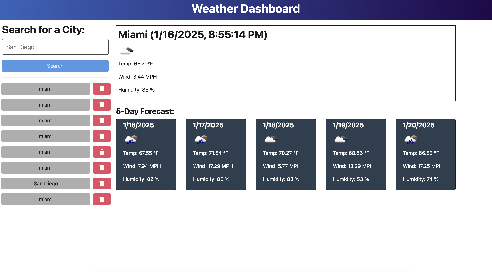

# What's the Weather?

## Table of Contents
- [Description](#description)
- [Technologies Used](#technologies-used)
- [Installation](#installation)
- [Usage](#usage)
- [API Calls](#api-calls)
- [Deployment](#deployment)
- [Contributing](#contributing)
- [Contributors](#contributors)
- [License](#license)

## Description
The Weather Dashboard application allows users to view the current and future weather conditions for multiple cities. Utilizing the OpenWeather API, the application fetches weather data based on user input, displays current weather conditions, and provides a 5-day forecast. Users can also access their search history for easy reference.

Live deployed application: https://what-s-the-weather.onrender.com



## Technologies Used
- HTML
- CSS
- JavaScript (TypeScript)
- Node.js
- Express
- OpenWeather API

## Installation
1. Clone the repository to your local machine:
   ```bash
   git clone https://github.com/yourusername/weather-dashboard.git
2. Navigate to the project directory:
   ```bash
    cd weather-dashboard
3. Install the necessary dependencies:
   ```bash
    npm install

## Usage
1. Start the server:
   ```bash
    npm run start
2. Open your browser and navigate to http://localhost:3001.
3. Use the search input to find the weather for your desired city.
4. View the current conditions and the 5-day forecast displayed on the dashboard.

## Example of Application

## API Calls
The application makes use of the OpenWeather API to fetch weather data. Here’s an example of the API endpoint used for fetching the weather forecast:

https://api.openweathermap.org/data/2.5/forecast?lat={lat}&lon={lon}&appid={API_KEY}

Make sure to replace `{lat}`, `{lon}`, and `{API_KEY}` with the appropriate values.

## Deployment
The application is deployed on Render. You can access the live application at [https://whats-the-weather-tplh.onrender.com/].

## Contributing
Contributions are welcome! If you have suggestions for improvements, please fork the repository and create a pull request.

## Contributors
- Jake Watson
- Martha Watson(Peer): API intergration, debugging, peer support.
- Nick S(BootCamp tutor): Debugging and mentorship.
- David Park(BootCamp tutor): Debugging and mentorship.

## License
This project is licensed under the [MIT](https://opensource.org/licenses/MIT) license.

## Questions
If you have any questions about the project, feel free to contact me:

- GitHub: [JakeStair](https://github.com/JakeStair)
- Email: jacob.watson00@yahoo.com